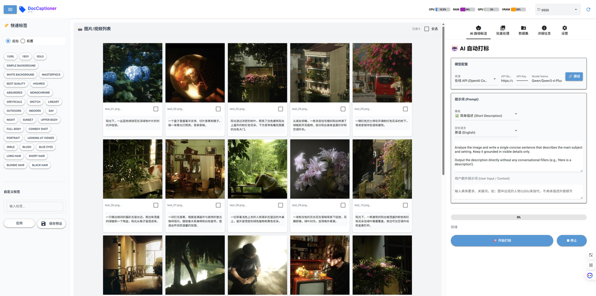

# DocCaptioner v1.0

**DocCaptioner** 是一款基于 NiceGUI 构建的现代化本地图像/视频打标与数据集管理工具。它集成了先进的 **Qwen 3-VL** (Vision-Language) 视觉大模型，旨在为 AI 训练提供高效、流畅的“工作室级”数据准备工作流。



---

## ✨ 核心功能

*   **📸 交互式画廊 (Gallery Studio)**
    *   **高效浏览**：支持海量图片/视频的平滑滚动加载。
    *   **即时打标**：直接在卡片上编辑标签，支持追加/前置模式。
    *   **智能预览**：
        *   **图片**：悬停显示放大镜，点击查看高清大图。
        *   **视频**：支持**原地点击播放 (Click-to-Play)**，无需弹窗即可快速预览，亦可全屏播放。
        *   **性能优化**：自动生成缩略图，避免大量媒体加载导致的显存溢出 (OOM)。

*   **🤖 Qwen 3-VL 自动打标 (Auto Captioning)**
    *   **本地 GPU 加速**：支持 NVIDIA (CUDA) 和 AMD (ROCm) 显卡，利用本地算力快速生成高质量描述。
    *   **在线 API 支持**：兼容 OpenAI 格式的在线 API (如 vLLM, Ollama, OneAPI 等)。
    *   **多语言支持**：支持中文、英文及双语输出。
    *   **自定义提示词**：内置多种风格模板（详细描述、标签生成、电影感等），支持用户自定义 Prompt。
    *   **视频理解**：支持对视频文件进行抽帧分析并生成摘要或描述。

*   **📊 系统性能监控 (System Monitor)**
    *   **实时仪表盘**：在顶部标题栏实时显示 **CPU、RAM、GPU、VRAM** 的使用率。
    *   **可视化图表**：直观的进度条和百分比显示，助您掌控硬件状态，防止过载。
    *   **硬件详情**：在设置页查看详细的 CPU/GPU 型号及驱动信息。

*   **📂 数据集管理 (Dataset Manager)**
    *   **一站式管理**：创建、删除、切换数据集，支持 ZIP 压缩包的导入与导出。
    *   **文件操作**：支持批量重命名、删除、移动文件。

*   **✏️ 批量处理 (Batch Editor)**
    *   **图像编辑**：批量调整大小 (Resize)、裁剪 (Crop)、旋转 (Rotate)、格式转换 (Convert)。
    *   **智能重命名**：支持自定义前缀的顺序重命名。

---

## 🚀 安装指南

### 1. 前置要求
*   **Python 3.10 或 3.11**
*   **Git**

### 2. 快速开始
克隆仓库并运行安装脚本：

```cmd
git clone https://github.com/DocWorkBox/DocCaptioner.git
cd DocCaptioner
install.bat
```

安装程序会自动引导您选择硬件加速类型：
1.  **NVIDIA GPU** (推荐 RTX 30/40/50 系列)
2.  **AMD GPU** (支持 RX 6000/7000 系列，基于 ROCm)
3.  **CPU Only** (仅限无显卡环境，速度较慢)

### 3. 启动应用
安装完成后，运行：
```cmd
start.bat
```
浏览器将自动打开 `http://127.0.0.1:9090`。

---

## 🛠️ 使用说明

### 🤖 自动打标
1.  进入 **AI 自动标注** 选项卡。
2.  **选择模型**：
    *   **预设模型**：初次使用会自动从 HuggingFace 下载 Qwen-VL 模型。
    *   **本地路径**：可指定本地已下载的模型文件夹或 GGUF 文件。
    *   **在线 API**：输入 API URL 和 Key 使用远程服务。
3.  **设置提示词**：选择模板或输入自定义要求（例如：“图中出现的人物以D0c来指代，不具体描述外貌细节”）。
4.  **选择文件**：在左侧画廊勾选图片/视频（或全选）。
5.  **开始**：点击 **🚀 开始打标**。

### 📂 数据集管理
1.  进入 **数据集** 选项卡。
2.  **新建**：点击“新建数据集”创建文件夹。
3.  **导入/导出**：支持上传图片/ZIP 包，或将当前数据集打包下载为 ZIP。

### ⚙️ 设置与监控
*   在 **设置** 选项卡中开启/关闭顶部的性能监控面板。
*   查看当前加载的模型、显存占用及系统详细信息。

---

## 🤝 致谢与许可

*   **GUI 框架:** [NiceGUI](https://nicegui.io/)
*   **AI 核心:** [HuggingFace Transformers](https://huggingface.co/docs/transformers/index) & [Qwen-VL](https://github.com/QwenLM/Qwen-VL)
*   **AMD 支持:** [ROCm for Windows](https://github.com/ROCm/TheRock)

Created by **Doc_workBox**.
